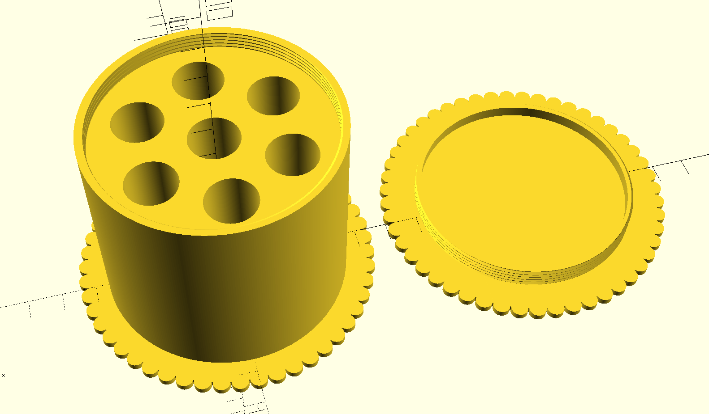
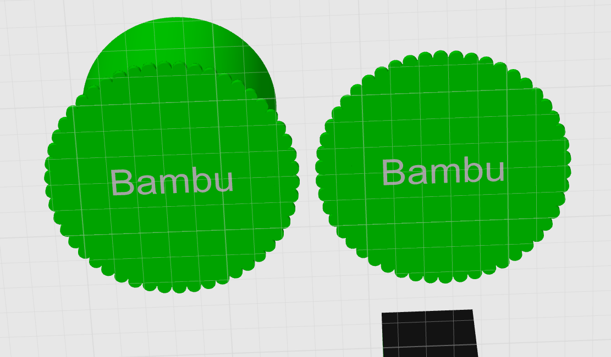
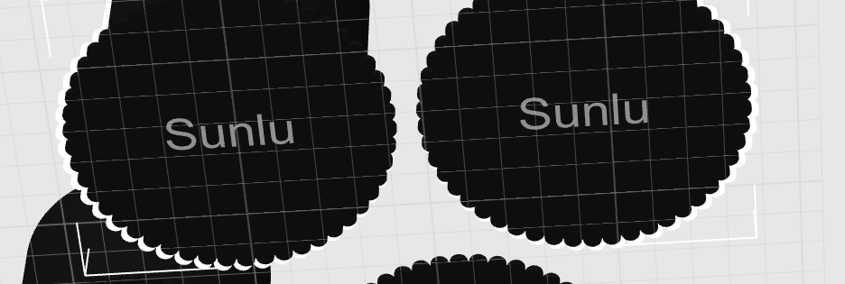

# Parametric Spool Weight

Parametric spool weight used to weigh down spools in a Bambu Lab AMS.

If you like me have multiple brands, it includes a label on the ends of each cap to help identify the spools it's printed for.

## Parameters

| Parameter | Type | Default | Description |
| --- | --- | --- | --- |
| spool_diameter | float | 72 | diameter of the inside of the spool |
| spool_thickness | float | 62 | thickness of the inside of the spool |
| num_weights | int | 7 [options: 1,3,5,7,9] | number of weight cavities, created with a center cavity, then in a circle around |
| label | string | "" | label to embed on the end caps for which spool it's sized for |
| weight_diameter | float | 14.5 (AA battery) | diameter of the weight |
| weight_height | float | 50.5 (AA battery) | height of the weight |

## Setup

This model has a dependency on [BOSL library](https://github.com/revarbat/BOSL) used to generate the threads for the screw cap.

Download the BOSL library and put it in a BOSL folder in this repository (it is included in the .gitignore so it will not get included in any commits).